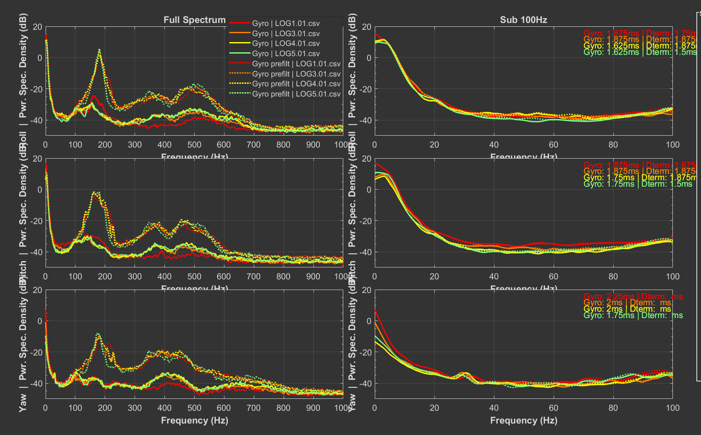
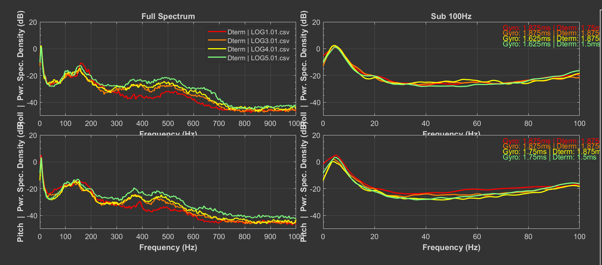
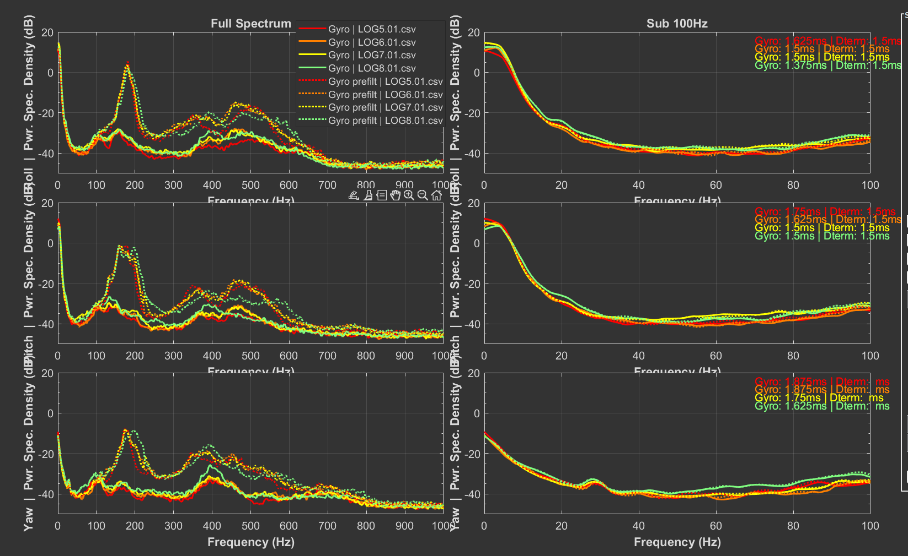
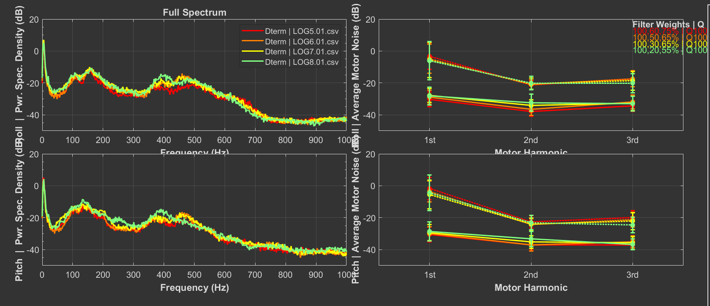
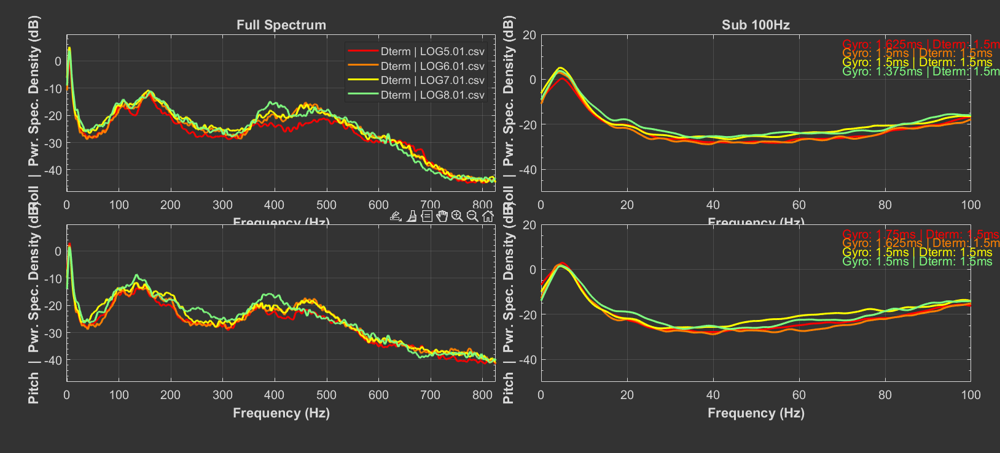
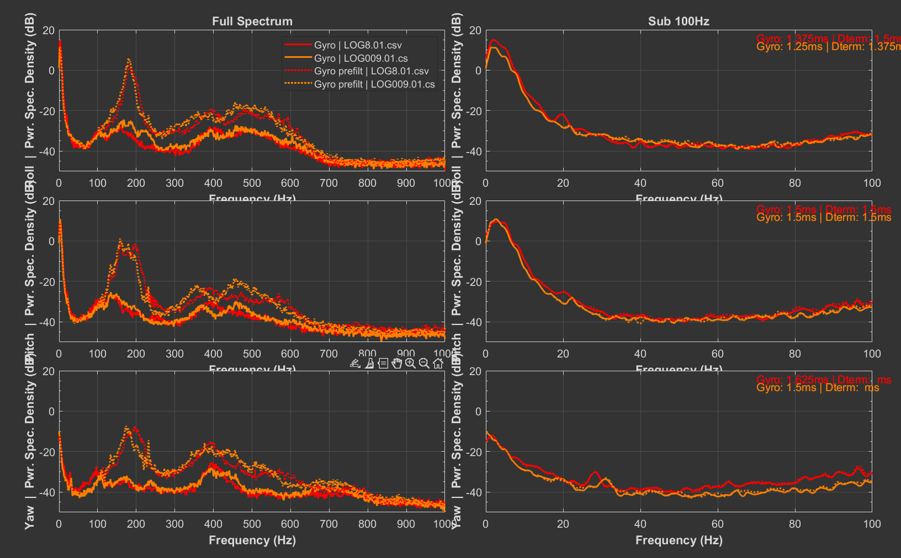
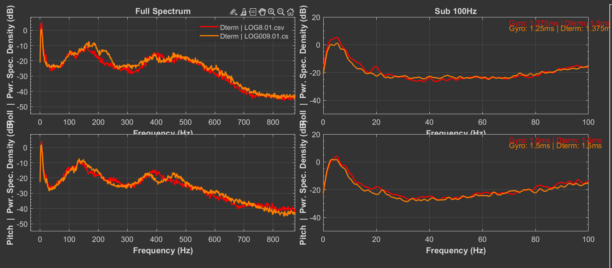

# Project: 5-inch FPV Drone Filtering and PID Tuning (Betaflight 4.6, PIDToolbox)

## Table of Contents

1.  [Description](#description)
2.  [Tuning Goals & ](#tuning-goals)
3.  [Technical Criteria](#Technical-criteria)
4.  [Specifications](#specifications)
5.  [Test Flight Types](#test-flight-types)
6.  [Filtering Optimization Process](#filtering-optimization-process)
    - [Optimization Process and Latency Analysis](#optimization-process-and-latency-analysis)
    - [Summary & Spectrograms](#summary)

## Description

This repository is a technical documentation of the 5-inch FPV drone tuning process. The methodology and data analysis are primarily based on the educational materials and software from **PID toolbox, created by Brian White**. This repository contains a collection of materials, logs, and configuration dumps that step-by-step document the process of optimizing settings in Betaflight 4.6.

## Tuning Goals

The main goal of this process was to achieve the following results through precise tuning of filters and the PID loop:

*   Improved responsiveness and control precision.
*   Maximum elimination of **propwash**.

## Technical Criteria:

#### Filtering:
*   Reduction of frequency noise to below **-10dB** on the spectrum analyzer.
*   Gyro delay around **1.5ms**.
  
It should be noted that the above values are indicative. The key is to find a balance, as overly aggressive filtering introduces latency, while insufficient filtering can lead to overheating motors.

#### PID tuning:
*(To be documented in the future)*

## Specifications

*   **Frame:** Mark4 5" (225mm)
*   **Flight Controller (FC):** YSIDO F4 V3S PLUS
*   **ESCs:** YSIDO 45A 4-in-1 (flashed with Bluejay)
*   **Motors:** YSIDO 2205 2300KV
*   **Propellers:** iFlight Nazgul F5 (5140) 3-blade
*   **Battery:** CNHL 4S 1500mAh 100C

## Test Flight Types

Data for analysis was collected using three key methods:
### 1. Basic Wobble Test

#### Configuration
This method involves generating continuous, sinusoidal movements in the Roll and Pitch axes using a transmitter script.

**Source:**
https://www.youtube.com/watch?v=NczSDkKn9pY&ab_channel=PIDtoolbox

It should be used with **Angle Mode** set to the following specific parameters:

  

1. Duration: ~30 second 
2. Continuously modulate the throttle to to keep the drone up and down 1-2 mteres

### 2. Verification Flight

1.  Perform a standard, smooth flight in Acro mode, avoiding sharp maneuvers.
2.  After landing, **check the motor temperature**. They should be slightly warm at most.
    *   **Note:** If the motors are hot, do not proceed to the next step. This indicates a problem with insufficient filtering that must be resolved first.

### 3. Full Throttle Flight

1.  Perform **2-3 full punchouts**, keeping the throttle at a high level for a few seconds.
2.  During high-throttle flight, perform a **series of quick, full-stick deflections** in each axis.

## Filtering Optimization Process

### Optimization Process and Latency Analysis

The following table presents the chronological progression of changes made and their impact on system latency. The values in each cell are shown in the format **`Gyro / Dterm`** (in milliseconds).

| Step | Change Made | Resulting Log | Roll (Gyro / Dterm ms) | Pitch (Gyro / Dterm ms) | Yaw (Gyro / Dterm ms) |
| :--: | :--- | :---: | :---: | :---: | :---: |
| 0 | **Default values** | **Log 1** | 1.875 / 1.75 | 1.875 / 1.875 | 2.25 / - |
| 1 | `rpm_filter_weights = 100, 60, 75` | **Log 2** | No data | No data | No data |
| 2 | `rpm_filter_q = 1000`, `q_factor = 300`, `notch_count = 3` | **Log 3** | 1.875 / 1.875 | 1.875 / 1.875 | 2.0 / - |
| 3 | `gyro_filter_multiplier = 2` | **Log 4** | 1.625 / 1.875 | 1.75 / 1.875 | 2.0 / - |
| 4 | `dterm_filter_multiplier = 1.3` | **Log 5** | 1.625 / 1.5 | 1.75 / 1.5 | 1.875 / - |
| 5 | `rpm_filter_weights = 100, 50, 65` | **Log 6** | 1.5 / 1.5 | 1.5 / 1.5 | 1.875 / - |
| 6 | `rpm_filter_weights = 100, 30, 65` | **Log 7** | 1.5 / 1.5 | 1.5 / 1.5 | 1.75 / - |
| 7 | `rpm_filter_weights = 100, 20, 55` | **Log 8** | 1.375 / 1.5 | 1.5 / 1.5 | 1.625 / - |
| 8 | `dynamic_notch_q = 350` | **Log 9** | 1.25 / 1.375 | 1.5 / 1.5 | 1.5 / - |

#### Summary
*   **The optimization process was stopped at step 8.** Analysis of `log009` showed that the `dterm` noise still exceeded the target level of -10dB.
*   Motor temperature after test flights was acceptable (motors were slightly warm, but not hot), suggesting that the overall filtering is close to optimal but requires further precise adjustment.

##### Logs 1-5:

---

##### Logs 5-8: Decreasing 'rpm_filter_weights'

---

##### Logs 8-9: Decreasing 'dynamic_notch_q'

